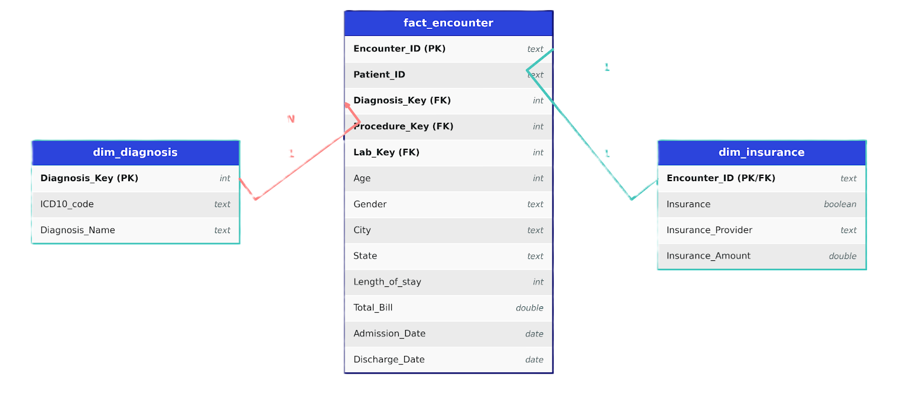
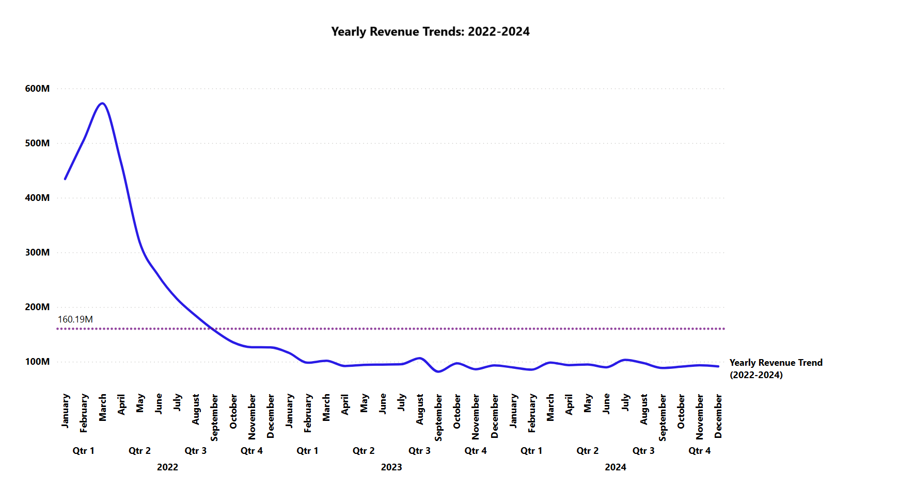
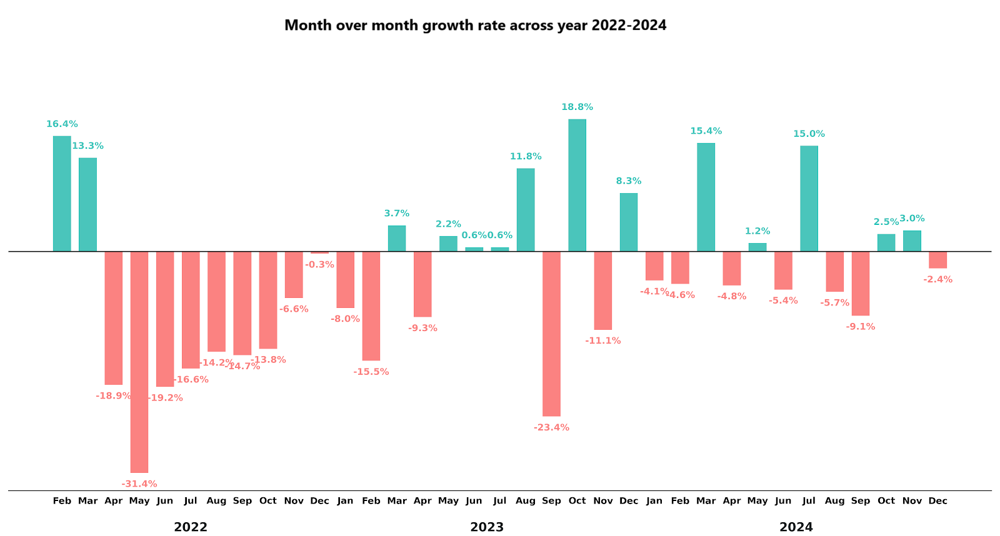
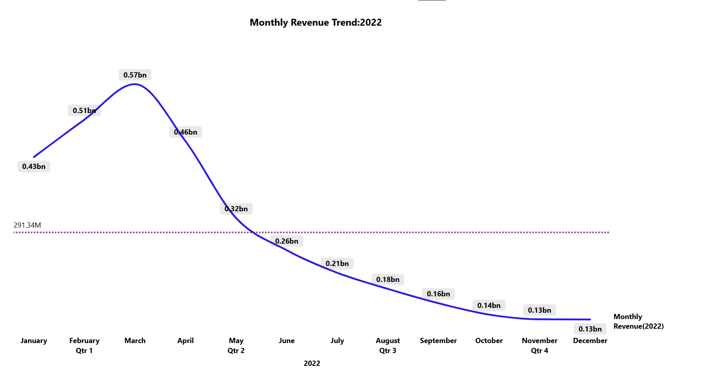
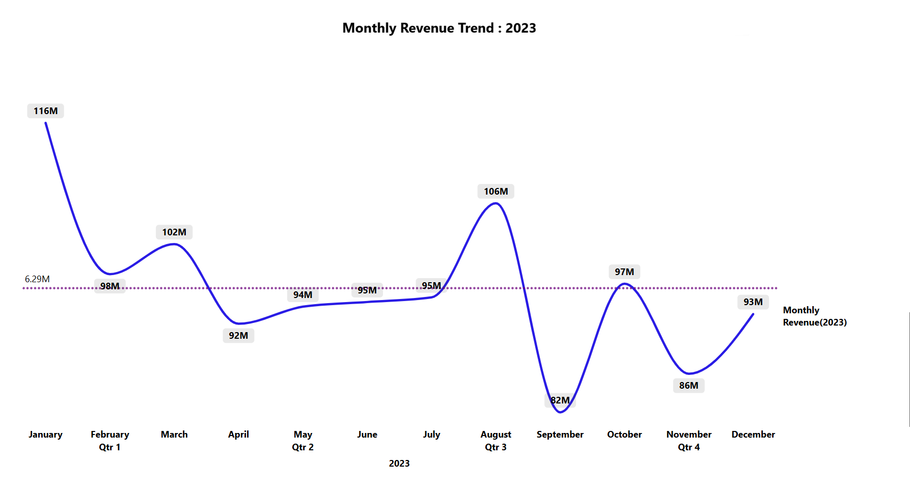
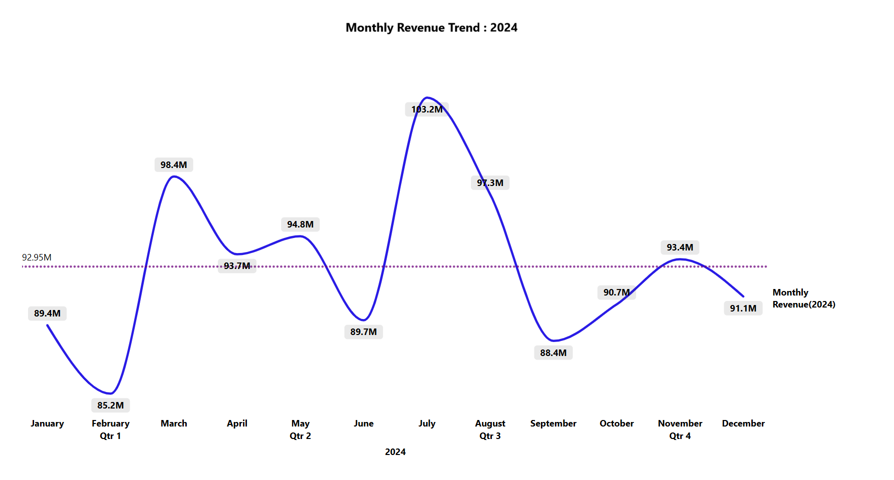
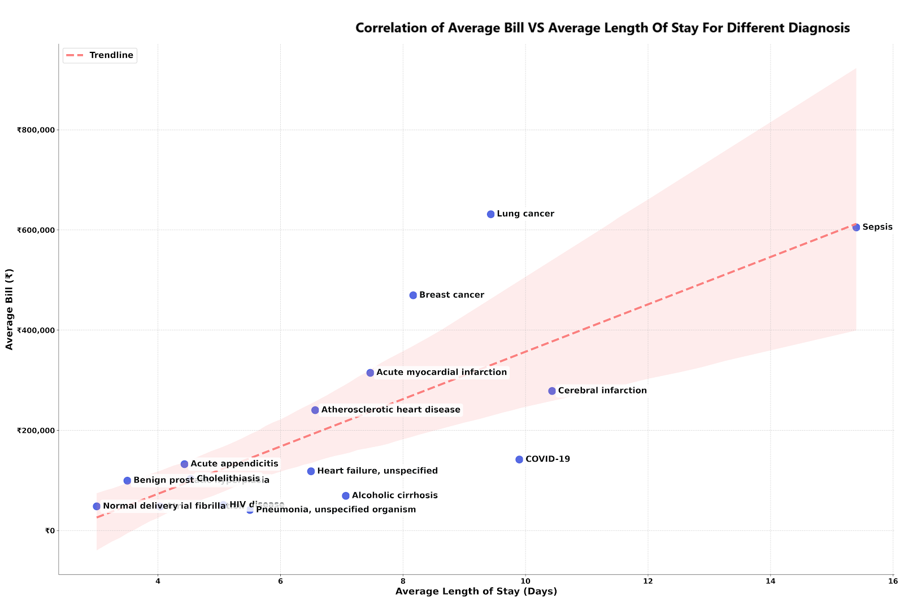
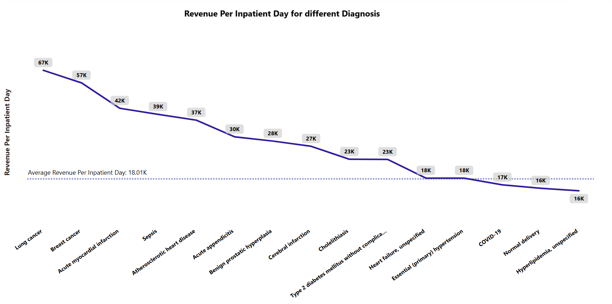
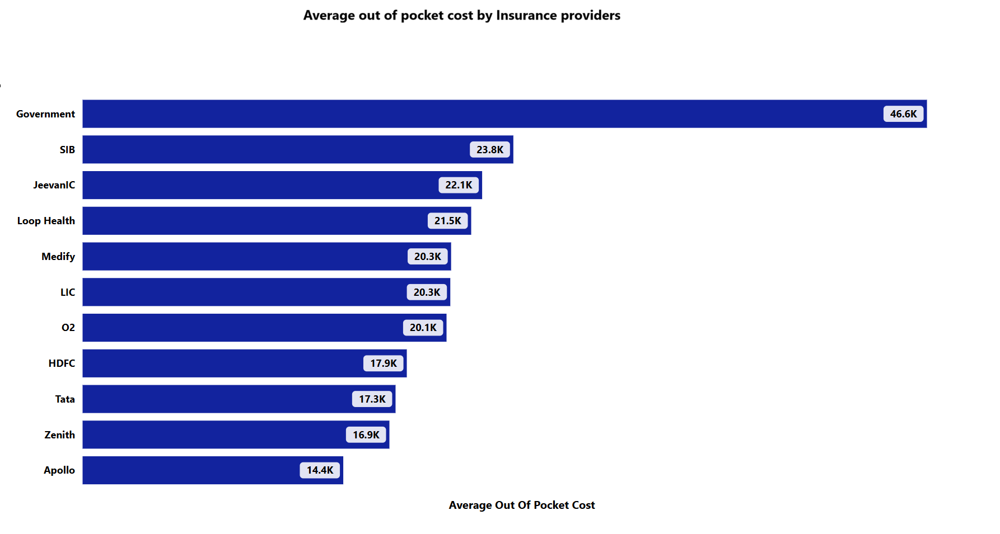

# Hospital Operations and Financial Trend Analysis
## Background Information

* **Mednet Hospital** is a super-speciality hospital established in 2001 in **Mumbai**, **Maharashtra** with one of the highest patient bases across the country, which was at an all-time high during 2022. The hospital has all the necessary departments to treat patients across a broad range of diagnoses, making it a popular choice among residents. The hospital incurs an average net revenue of **₹1152M** per year, which reached a record high in **2022** with a net revenue of **₹3500M**.

* This report is prepared for the evaluation of the hospital's financial, operational, regional, and contract yield performance over the past several years (2022–2024). The report provides valuable insights and recommendations that will be utilized by the internal finance, revenue cycle, marketing, and operations teams to improve the hospital's overall efficiency and performance. Recommendations will be delivered to the Chief Finance Officer (CFO), Hospital Administrator, and Operations Manager.
Key recommendations and insights are based on the following areas:

#### Northstar Metrics

* **Financial trend analysis** : Focusing on key metrics like yearly revenue, monthly revenue, Year-on-Year growth rate (YoY), and Month-on-Month growth rate (MoM) for revenue trends and identifying seasonal dips to evaluate the hospital's growth strategy.
* **Service Line Profitability and Bed utilization yield** : Analyzing the relationship between Average Length of Stay (ALOS) and average bill, as well as Revenue per Inpatient Day (RPID) across different diagnoses, for smooth operations across service lines and identifying bottlenecks and bed blockers.
* **Payer Mix and Contract yield** : Identifying the realization rate and average out-of-pocket cost by different insurance providers to evaluate their performance and avoid financial burden.
* **Regional Market Penetration** : Regional analysis of net revenue across different cities and their patient base to identify high-value markets and areas of improvement.

## Entity-Relationship Diagram 

* The dataset consists of the following tables: Fact_Encounter, Dim_Insurance, and Dim_Diagnosis, with a total of approximately **100K** records.
 
 Here is my ERD diagram :
 

 ## **Executive summary** :

* Year 2022 shows the highest net revenue of ₹3500M due to the high volume of COVID patients, accounting for approximately 69% of total revenue (Critical Care), which decreased to ₹1164M in 2023 with a YoY growth rate of -64%, then stabilized to ₹1123M in 2024 with a YoY decline of -3.5%, indicating post-COVID normalization. Q2 and Q3 of 2023 and 2024 both show an increase in MoM growth rate in revenue, possibly due to seasonal shifts.

 * In 2023 and 2024, our most valuable service lines based on revenue generation and average length of stay are Cardiology and Chemotherapy, with a major red flag being Alcoholic Cirrhosis, which has the lowest revenue and a relatively high ALOS. COVID, being an outlier, generated high overall net revenue despite lower revenue per inpatient day.

 * In the hospital, only 60% of total IPD patients are insured, with LIC (35%) and Jeevan IC (15%) having the largest patient base. Despite this,  LIC and Jeevan IC have a low realization rate (~65%) and a relatively higher average out-of-pocket cost. The major red flag is Government Insurance with only a 27% realization rate and the highest average out-of-pocket cost.
 * Bangalore, Hyderabad, and Delhi are major patient hubs that, despite their distant locations, generate potentially greater revenue than most in-state cities. While Mumbai and Pune are the top-performing cities, Osmanabad, Aurangabad, and Solapur did not perform well despite their location advantage.
 

### **1. Financial trend analysis** :

| Year | Net Revenue |Avg.Monthly Revenue | YoY Growth | 
| :---:| :-----------| :--------------:   | :----------| 
| FY22 |   3500M     |   291M             |   -        |   
| FY23 |   1164M     |   96.2M            |   -64%     |   
| FY24 |   1123M     | 93M                |   -3.5%    |   

       

* **FY-22**: Year 2022 showed a historically high net revenue of **₹3500M**, which declined exponentially at a monthly average growth rate of **~-9.4%** through **Q1** of 2023, then stabilized due to post-COVID normalization. In Q1 of 2022, monthly revenue peaked at an all-time high of approximately **₹570M** in **February**, with an average growth rate of +16%. The start of **Q2** showed a massive decline in net revenue, with an all-time low monthly growth rate of approximately **~-33%** in **May**, with monthly revenue of 320M, possibly due to a high discharge rate, followed by a continuous decline in revenue at an average rate of ~-15%, leaving an average revenue of **₹140M** in **Q4**. This was possibly due to the rapid decline in COVID patient volume, which was the largest contributor to revenue in 2022.

* **FY-23**: Year 2023 showed a rapid decline in the YoY growth rate of **-64%** with a net revenue of **₹1164M** due to pandemic normalization. From May to August 2023, monthly revenue increased to ₹95M with a monthly average growth of ~6–7%, indicating normalization, followed by a significant dip in revenue (₹82M) in **September** at a rate of **-23%**.

* **FY-24**: 2024 recorded a net revenue of **1123M** with a YoY decline of **~3.5%**. Q1 began with a dip in revenue in January and February, followed by a steady increase through the end of Q3, with monthly revenue peaking in **July (₹103M)**, then a significant decline in revenue (₹88.4M) in **September** at a rate of **-9.3%**. Similar trends were observed in 2023 and 2024, with revenue declining at the end of Q4 and the start of Q1, along with a dip in revenue during September in both years. The increase in average revenue growth between Q2 and Q3 in 2023 and 2024 indicates seasonal fluctuations; during the monsoon season, the number of patients with viral and bacterial infections rises, which likely contributes to the revenue increase between Q2 and Q3.

### **2. Service Line Profitability and Bed Utilization Yield** :

   

* In 2022, COVID was the highest contributor to revenue at ~69%, with an average length of stay of ~10 days and an average bill of 168K. In 2023 and 2024, the top service lines and their contributions to revenue were Lung Cancer (14%), Sepsis (13.4%), Breast Cancer (13.2%), Acute Myocardial Infarction (14%), and Atherosclerotic Heart Disease (AHD) (14.65%).

* **High Value**: Based on the correlation between ALOS and average bill, **Lung Cancer** with an average bill and ALOS of ₹598K & 9.1, **Breast Cancer** with ₹595K & 8.4, **AHD** with 248K & 6.7, and **Acute Myocardial Infarction** with ₹308K & 7.4 are the most profitable service lines due to their higher average bills and relatively comparable ALOS. They also have the highest Revenue per Inpatient Day, which further underscores their value.

* **Average Value**: **Sepsis**, despite having a high average bill (593K), is an average performer due to its larger ALOS (15), with an RPID of ₹39.3K. Similarly, **Cerebral Infarction** (₹269K, 10.4) and **Heart Failure Unspecified**, with an average bill and ALOS of ₹121K & 6.6, have an RPID of ₹18.1K.

 * **Red Flag**: **Alcoholic Cirrhosis**, with an average bill and ALOS of ₹57K and 7.2 (69% higher than the overall average ALOS), has an RPID of ₹8.9K — 53.3% below the average RPID. It is a potentially low revenue generator despite its higher ALOS, which may reduce profitability and contribute to bed blocking.
* **COVID**, with an average bill of 168K in 2022 and a relatively higher ALOS, had a low RPID of ₹16.7K — 10% below the average Revenue per Inpatient Day (₹18.5K). Despite generating higher overall revenue in 2022, it was primarily responsible for bed blocking, which created a significant clinical bottleneck.

### **3. Payer Mix and Contract Yield**:

  

* Across all years 2022–2024, only **60.3%** of total IPD patients are insured, indicating a significant gap in market coverage. Among all insurance providers, LIC has the largest patient base (35.3%), followed by Jeevan IC (15.24%), Tata (15.06%), Apollo (10%), and HDFC (7.1%).

* The realization percentage, which determines the proportion of the total bill covered by the insurance provider, is highest across all years for **Apollo** at **~77.5%** — 16.6% above the average realization rate of 66%. It also records the lowest average out-of-pocket cost of **₹14.4K**, making it the insurance provider with the least financial burden for patients. This is followed by Tata, with a realization percentage of 73.5% and an average out-of-pocket cost of ₹17.3K, and HDFC with a 73% realization rate and an average out-of-pocket cost of ₹17.9K.

* **LIC**, despite being the largest insurance contributor, covers only **68%** of the total bill and carries an average out-of-pocket cost of **₹20.3K**. Additionally, **Jeevan IC**, the second-largest contributor, has a realization rate of **66%** and an average out-of-pocket cost of **₹22.1K**. This leaves the majority of patients with significant financial debt, and contract renegotiations with both LIC and Jeevan IC should be prioritized immediately.

* The major red flag among insurance providers is **Government** Insurance, with a shockingly low realization percentage of **28.5%** — 57% below the average realization rate. It also has the highest average out-of-pocket cost of **₹46.6K**. Our contract with Government Insurance needs to be fundamentally reconsidered.

### **4. Regional Market Penetration**:

  

* Year 2022 showed the highest revenue across all cities, with Mumbai being the largest revenue generator at approximately ₹560M, followed by Pune (₹408M), Delhi (₹288M), Bangalore (₹231M), and Hyderabad (₹216M). A similar trend was observed in 2023 and 2024.
* Among in-state cities, Mumbai has the highest patient base at an average of 4.4K patients per year, followed by Pune with 3.2K, Nagpur with 2K, and Nashik with 1.4K.
* Delhi, Bangalore, and Hyderabad, despite being non-state cities, still generate higher revenue and have a larger patient pool than most in-state cities, making them highly valuable markets.
* Osmanabad, Aurangabad, and Solapur underperformed due to a low patient base despite their location advantage.

## Business Recommendation 

### **Finance** :
* To reduce the financial burden on the hospital, we should renegotiate contracts with insurance providers to increase the realization percentage to 80–85%. We need to restructure contracts with LIC and Jeevan IC to reduce average out-of-pocket costs, as these providers have a larger patient pool. The contract with the Government Insurance provider, which has the lowest realization rate and leaves patients with the highest debt, must be urgently revised.
### **Marketing** :
* Bangalore, Delhi, and Hyderabad, despite being non-state cities, have a larger patient base and generate high revenue, making them the ideal locations to open satellite clinics. Osmanabad, Aurangabad, and Solapur have underperformed despite their location advantage; targeted marketing campaigns are needed to increase patient volume in these areas.
### **Operations**
* Lung Cancer and Breast Cancer (Chemo), along with AHD and Myocardial Infarction (Cardio), are the most valuable service lines. Investment in these service lines should be increased to improve their operational efficiency. Sepsis, Cerebral Infarction, and Heart Disease service lines should be closely monitored for optimal bed utilization, given their higher average lengths of stay. Alcoholic Cirrhosis, with its high ALOS and significantly low revenue generation, requires immediate bed occupancy optimization; otherwise, it will contribute to bed blocking for other service lines.

## Tools Use 

| Tool Used                        | Use                                          |
|:------------:                |  :------------------------------------------- |
|Excel & Power Query           | For Data Cleaning and Transformation          |
|VS code                       | To write complex queries(Using Window functions, CTE and Subquery) for Analysis         |
|MySQL                         | For connecting to database                    |
|PowerBI                       | For data visualization                        |
|AI tool(GPT, Gemini and Claude)| For research and Simulated dataset generation |

* Images used in report are [here](Images/ERD.png)

* SQL queries used for analysis are [here](SQLqueries/)

